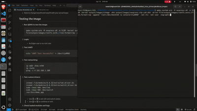

# Embedded Linux Drivers Course Project

## Author: [Mohamed Newir](https://www.linkedin.com/in/mohamed-newir-a8a572182)

## Overview

This project is part of the **Linux Embedded Drivers** course at **Edges Academy**. The objective is to construct a fully functional image using Buildroot for the QEMU ARM VExpress target board. It involves configuring the boot process with U-Boot, setting up the Linux kernel, initramfs, and root filesystem, customizing the device tree, and ensuring the system supports UART logging, networking, a custom block device driver, and a demo application.

## Prerequisites

Before beginning, ensure the following are available:

- **Buildroot version 2024.11**
- **Linux kernel version 6.6.32**
- **Ubuntu 24.04** machine
- **QEMU** for emulation
- Essential development tools (e.g., `make`, `gcc`)

## Project Setup

1. Clone or download **Buildroot version 2024.11**.

2. Navigate to the Buildroot directory.

3. Set up the default configuration for the QEMU ARM VExpress board:

   ```bash
   make qemu_arm_vexpress_defconfig
   ```

## Configuration Steps

1. **Customize the configuration with** `make menuconfig`**:**

   - Use arrow keys, Enter, and Space to navigate and select options.
   - **System Configuration:**
     - **System hostname:** `edges-system`
     - **Root password:** `Edges2025`
     - **Run a getty (login prompt) after boot:** `ttyAMA0` (UART console)
     - **User tables:** Add path to `board/mytarget/users.txt`
   - **Bootloaders:**
     - Enable **U-Boot**
     - **Board defconfig:** `vexpress_ca9x4`
   - **Kernel:**
     - Ensure **Linux Kernel** is selected
     - **Defconfig name:** `vexpress`
     - Choose Linux kernel version **6.6.32**
   - **Toolchain:**
     - Enable **C++ support**
     - Choose **GCC compiler version 12.x.x**
   - **Filesystem Images:**
     - Enable **initial RAM filesystem linked into Linux kernel**
     - Enable **ext2/3/4 root filesystem**, select **ext4**, set size to **512M**
   - **Target Packages:**
     - Under **Networking**, enable **dhcpcd** for Ethernet support

2. **Build initial image:**

    ```bash
    make
    ```

3. **Modify the terminal prompt:**

   - Edit `output/target/etc/profile`:

     ```bash
     nano output/target/etc/profile
     ```

     Add:

     ```bash
     # Default PS1 for all users
     PS1='\u@\h:\w\$ '
     
     # Customize PS1 for the Edges user
     if [ "$USER" = "Edges" ]; then
         PS1='Edges@edges-system:\w\$ '
     fi
     
     export PS1
     ```

4. **Add custom drivers and applications:**

   - Create `demo-app` and `edges-drivers` directories under `packages/`.

   - Edit `packages/Config.in`:

     ```makefile
     @Miscellaneous
         source "package/demo-app/Config.in"
     @Hardware handling
         source "package/edges-drivers/Config.in"
     ```

   - Configure in `make menuconfig`:

     - Under **Hardware handling**, enable **edges-drivers**
     - Under **Miscellaneous**, enable **Demo Application**

5. **Set up static networking:**

   - Edit `output/target/etc/network/interfaces`:

     ```bash
     nano output/target/etc/network/interfaces
     ```

     Add:

     ```bash
     auto lo
     iface lo inet loopback
     
     auto eth0
     iface eth0 inet static
         address 192.168.1.100
         netmask 255.255.255.0
     ```

## Building the Image

Build the image with:

```bash
make
```

If drivers or applications are modified, clean and rebuild:

```bash
make demo-app-dirclean
make
```

## Create an SD card image

   ```bash
   dd if=/dev/zero of=output/images/sdcard.img bs=1M count=512
   fdisk output/images/sdcard.img
   # Follow fdisk instructions to create partitions
   fdisk -l output/images/sdcard.img
   sudo losetup -f --show -o 1048576 --sizelimit 67108864 output/images/sdcard.img
   sudo losetup -f --show -o 68157440 output/images/sdcard.img
   sudo mkfs.vfat -F 32 /dev/loop38
   sudo mkfs.ext2 /dev/loop39
   mkdir -p mnt/boot mnt/rootfs
   sudo mount /dev/loop38 mnt/boot
   sudo cp output/images/zImage output/images/vexpress-v2p-ca9.dtb mnt/boot/
   sudo mount /dev/loop39 mnt/rootfs
   sudo tar -xpf output/images/rootfs.tar -C mnt/rootfs
   cat mnt/rootfs/etc/network/interfaces
   sudo umount mnt/boot mnt/rootfs
   sudo losetup -d /dev/loop38 /dev/loop39
   ```
   - Note to change loop38 and loop39 with your actual loops 

## Testing the Image

1. **Run QEMU to test the image:**

   ```bash
   qemu-system-arm   -M vexpress-a9   -m 512M   -kernel output/images/zImage   -dtb output/images/vexpress-v2p-ca9.dtb   -drive file=output/images/sdcard.img,format=raw  -append "root=/dev/mmcblk0 rw console=ttyAMA0"   -serial stdio   -net nic -net user 
   ```

2. **Login:**

   - As Edges user or as root user 

3. **Test UART:**

   ```bash
   echo "UART Test Successful" > /dev/ttyAMA0
   ```
   or
   ```bash 
   cat /dev/ttyAMA0
   ```

4. **Test networking:**

   ```bash
   ip addr show eth0
   ip route
   ping -c 4 192.168.1.100
   ```

5. **Test custom drivers:**

   ```bash
   insmod /lib/modules/6.6.32/extra/led_driver.ko
   insmod /lib/modules/6.6.32/extra/switch_driver.ko
   sudo chmod 666 /dev/led
   sudo chmod 666 /dev/switch
   /usr/bin/demo_app
   ```
   
   - Use `1` or `0` to set LED and switch states.
   - Use `y` or `n` to continue or exit.

6. **Check loaded modules and logs:**

   ```bash
   lsmod | grep led_driver
   lsmod | grep switch_driver
   dmesg | tail
   ls -l /dev/led /dev/switch
   ```


      

## Project Structure

```
Linux_Embedded_Drivers_Course_Project/
|
├── board/
│   └── mytarget/
│       └── users.txt
|
├── output/
│   └── images/
│       ├── rootfs.cpio
│       ├── rootfs.ext2
│       ├── rootfs.ext4
│       ├── rootfs.tar
│       ├── sdcard.img
│       ├── start-qemu.sh
│       ├── u-boot.bin
│       ├── vexpress-v2p-ca9.dtb
│       └── zImage
|
├── packages/
│   ├── demo-app/
│   │   ├── Config.in
│   │   ├── demo_app.c
│   │   └── demo-app.mk
│   └── edges-drivers/
│       ├── Config.in
│       ├── COPYING
│       ├── edges-drivers.mk
│       ├── led_driver.c
│       ├── Makefile
│       └── switch_driver.c
|
└── README.md
```

## Important Notes

- This image configuration works with **Buildroot version 2024.11** using **Linux kernel version 6.6.32** on an **Ubuntu 24.04** machine. Deviations from this environment may cause compatibility issues.

## Honest Opinion

This project demands considerable patience, particularly during compilation and error debugging. It often involves sniffing through numerous obscure websites, risking exposure to outdated information or even malware 😢. Without AI assistance like **Grok**, navigating the vast open-source community can feel like being lost at sea 🌊. If your working environment differs from the one specified, the image may not build correctly. For those considering a similar endeavor, I recommend exploring **Yocto** over **Buildroot** for its greater flexibility and support 😊👍.
