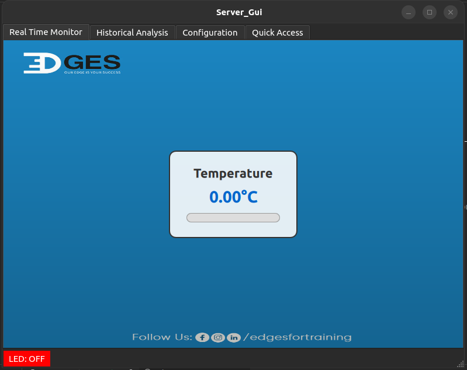
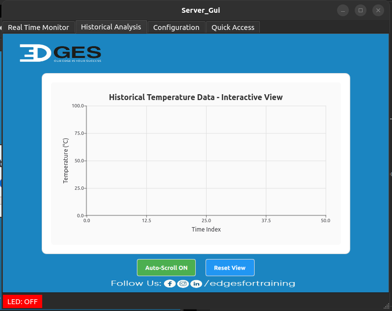
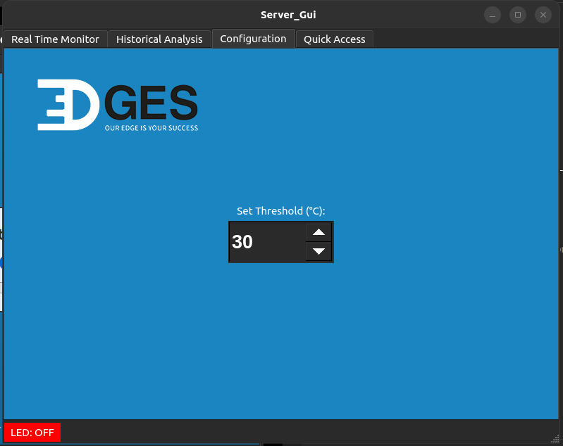
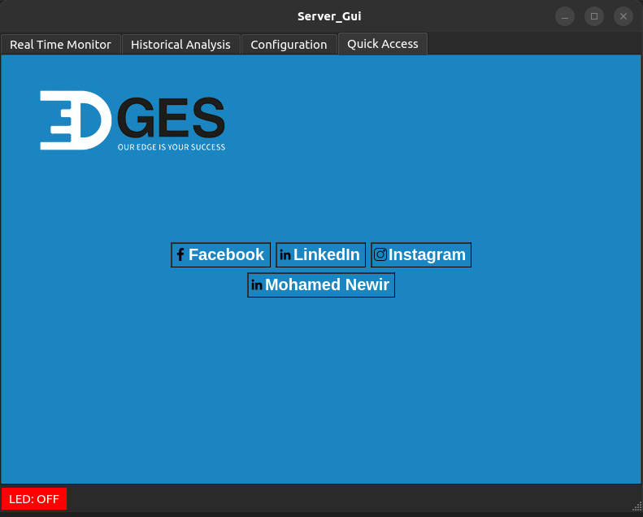

# Server GUI Driver

## Author: [Mohamed Newir](https://www.linkedin.com/in/mohamed-newir-a8a572182)

## Overview

This project implements a Qt6-based GUI application for a TCP socket programming driver in C++. The application serves as a server-side interface for communicating with a client over a TCP socket, managing temperature thresholds, and displaying temperature data and LED status. The GUI features four tabs: Real Time Monitor (QML-based meter), Historical Analysis (QML-based chart), Configuration (threshold setting), and Quick Access (social media links). The server logic runs in a separate thread, interacting with the client to send threshold updates and receive temperature readings.

## Objective

The objective of this project is to provide a user-friendly GUI for monitoring and controlling a temperature-based IoT system using TCP socket communication. Key features include:
- Real-time visualization of temperature data via a QML-based meter.
- Historical temperature data display using a QML chart.
- Configuration of temperature thresholds through a user interface.
- Quick access to social media links for project-related updates.
- Modular design with abstract interfaces (`Socket` and `Channel`) to support extensibility for TCP and UDP protocols.
- Integration of Qt6 for a modern, cross-platform GUI and C++ socket programming for robust network communication.

The project demonstrates the combination of Qt6 for GUI development, QML for dynamic visualizations, and socket programming for client-server interaction, suitable for educational and IoT application development purposes.

## Project Structure

The project is organized into the following directories and files:

```
/GUI
├── GUI_UML.png                   # UML diagram for the project
├── README.md                     # Project documentation
├── Tabs
│   ├── Config.png  
│   ├── EdgesQuickAcess.png
│   ├── HistoricalAnalysisTab.png 
│   └── RealTimeMonitorTab.png
└── Server_Gui
    ├── build                     # Build directory for compiled files
    ├── CMakeLists.txt            # CMake build configuration
    ├── CMakeLists.txt.user       # Qt Creator user settings
    ├── main.cpp                  # Application entry point
    ├── mainwindow.h              # MainWindow class declaration
    ├── mainwindow.cpp            # MainWindow class implementation
    ├── mainwindow.ui             # Qt Designer UI file (not provided but referenced)
    ├── server.h                  # Server class declaration
    ├── server.cpp                # Server class implementation
    ├── resources.qrc             # Qt resource file for icons and QML
    ├── Include
    │   ├── channel.hpp           # Abstract base class for communication channels
    │   ├── clientChannel.hpp     # Client-specific channel implementation
    │   ├── serverChannel.hpp     # Server-specific channel implementation
    │   ├── socket.hpp            # Abstract socket interface
    │   ├── TCPsocket.hpp         # TCP socket implementation
    │   └── UDPsocket.hpp         # UDP socket implementation
    ├── Lib
    │   └── libIoT_Device_Communication_System_Lib.a  # Static library for communication system
    └── Resources
        ├── icons
        │   ├── background.jpg    # Background image for GUI tabs
        │   ├── facebook.png      # Facebook icon for Quick Access tab
        │   ├── instagram.png     # Instagram icon for Quick Access tab
        │   └── linkedin.png      # LinkedIn icon for Quick Access tab
        └── qml
            ├── chart.qml         # QML file for Historical Analysis tab
            └── meter.qml         # QML file for Real Time Monitor tab
```

## Prerequisites

- **Qt6**: Qt Creator with Qt6 libraries for GUI development.
- **C++ Compiler**: A C++17 or later compatible compiler (e.g., `g++`).
- **CMake**: Version 3.16 or higher for building the project.
- **Operating System**: Linux, Windows, or macOS (Qt6 is cross-platform; socket code uses POSIX APIs, so some adaptation may be needed for non-Unix systems).
- **Libraries**: Qt6 libraries, standard C++ library, and POSIX socket libraries (`sys/socket.h`, `arpa/inet.h`, etc.) for Unix-like systems.
- **Static Library**: `libIoT_Device_Communication_System_Lib.a` (include socket-related implementations like `TCPSocket`, `ServerChannel`, etc.).

## Building the Project

1. Open the project in Qt Creator:
   - Launch Qt Creator and open the `CMakeLists.txt` file in the `Server_Gui` directory.
   - Configure the project with a Qt6 kit.

2. Alternatively, build manually using CMake:
   ```bash
   cd Server_Gui
   mkdir build && cd build
   cmake -DCMAKE_PREFIX_PATH=/path/to/Qt6 ..
   make
   ```
   - Replace `/path/to/Qt6` with the path to your Qt6 installation (e.g., `/usr/lib/qt6` or `C:\Qt\6.x.x\msvc2019_64`).

3. The build process generates an executable in the `build` directory (e.g., `Server_Gui`).

## Usage

### Running the GUI Application
1. Start the server GUI by running the executable, optionally specifying the IP address and port:
   ```bash
   ./Server_Gui/build/Server_Gui [ip] [port]
   ```
   - Default IP: `192.168.7.1`
   - Default port: `8080`
   - Example: `./Server_Gui/build/Server_Gui 127.0.0.1 8080`

2. The GUI will open with four tabs:
   - **Real Time Monitor**: Displays a QML-based meter showing the current temperature received from the client.
   - **Historical Analysis**: Shows a QML-based chart of past temperature readings.
   - **Configuration**: Allows setting a temperature threshold using a spin box.
   - **Quick Access**: Provides buttons to open social media links (Facebook, LinkedIn, Instagram).

3. The server runs in a separate thread, sending threshold updates or temperature requests to the client and updating the GUI with received temperatures and LED status.

### Running the Client
The GUI application requires a compatible client . To run the client:
1. Use the client executable:
   ```bash
   ./build/client [ip] [port]
   ```
   - Match the IP and port used for the server GUI (e.g., `./build/client 127.0.0.1 8080`).
2. The client will:
   - Connect to the server GUI.
   - Receive threshold updates and display them.
   - Prompt for temperature input when requested and send it to the server.

### Example Interaction
1. Start the server GUI:
   ```bash
   ./Server_Gui/build/Server_Gui 127.0.0.1 8080
   ```
   The GUI opens, showing the Real Time Monitor tab with an initial temperature of 30°C and LED status "OFF".

2. Start the client in another terminal:
   ```bash
   ./build/client 127.0.0.1 8080
   ```
   Client output:
   ```
   Attempting to connect to the server...
   Connected to the server.
   Received new threshold: 30 °C – LED Status: OFF
   ```

3. In the GUI’s Configuration tab, set a new threshold (e.g., 35°C):
   - The server sends: `set threshold 35 OFF`.
   - Client receives and displays: `Received new threshold: 35 °C – LED Status: OFF`.

4. The server periodically sends `get Temp` requests:
   - Client prompts: `Enter temperature: ` (e.g., enter `40`).
   - Client sends: `40`.
   - GUI updates the Real Time Monitor meter to 40°C, adds the value to the Historical Analysis chart, and sets LED status to "ON" (green) if temperature > threshold.

5. Use the Quick Access tab to open social media links for Edges For Training.

6. Close the GUI to stop the server and shut down the connection.

## Screenshot
Below is a screenshot of the GUI with its four tabs:

- **Real Time Monitor**: QML meter showing real-time temperature.


- **Historical Analysis**: QML chart displaying temperature history.


- **Configuration**: Spin box for setting the temperature threshold.


- **Quick Access**: Buttons linking to social media.



## Notes
- The server sends an initial threshold of 30°C with "OFF" status upon client connection.
- The LED status is updated based on whether the temperature exceeds the threshold ("ON" if temperature > threshold, else "OFF").
- The project includes a `UDPSocket` implementation, but it is not used in the current client-server logic (you can change to it in server/client app).
- Ensure the client is running and connected to the same IP and port as the server GUI.
- The static library `libIoT_Device_Communication_System_Lib.a` is contain socket-related implementations (e.g., `TCPSocket`, `ServerChannel`, etc.).
- The GUI uses Qt6’s QML for dynamic visualizations and C++ for socket communication, requiring proper Qt6 configuration in Qt Creator and CMake.

## UML Diagram
A UML class diagram is available as `GUI_UML.png` at the project root. It illustrates the class hierarchy, including the abstract `Socket` and `Channel` classes, their implementations, and the Qt-based `MainWindow` and `Server` classes.


