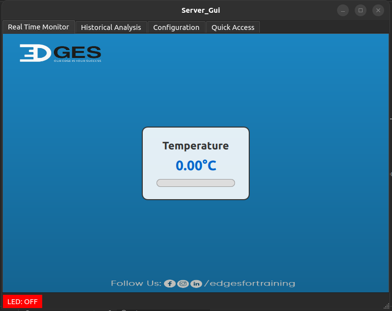
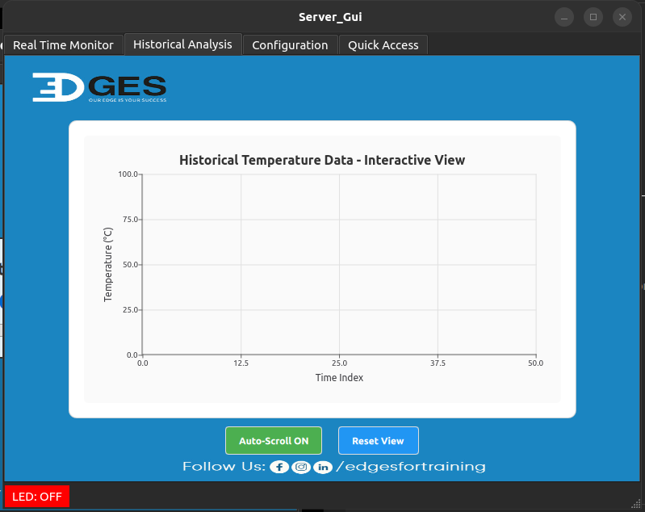
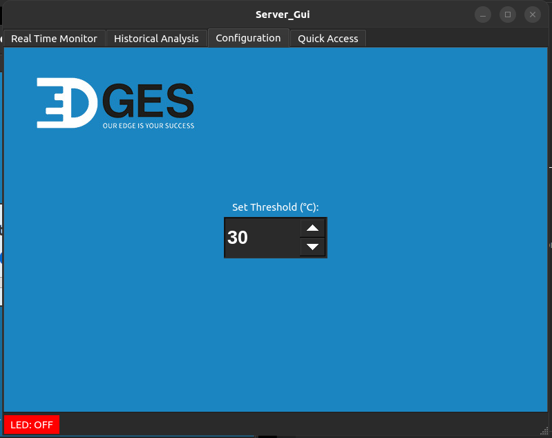
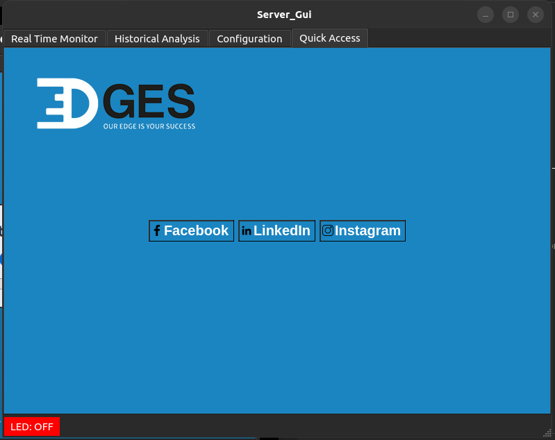
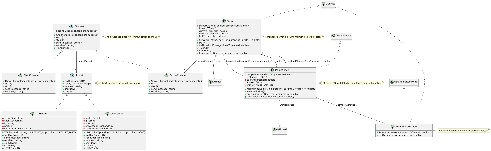

# Embedded Linux IoT Communication System

## Author: [Mohamed Newir](https://www.linkedin.com/in/mohamed-newir-a8a572182)

## Overview

This project is the final deliverable for the Embedded Linux Diploma at Edges For Training. It implements a comprehensive IoT communication system using TCP socket programming in C++, integrating a Qt6-based GUI server, a console-based server and client, and a Yocto-based client application running on QEMU. The system enables temperature monitoring and control, where a client running on QEMU  communicates with a server (GUI or console-based) to exchange temperature thresholds and readings, updating LED status based on the threshold. The project showcases modular design with abstract interfaces, cross-platform GUI development, and embedded Linux image creation.

## Objective

The objective of this project is to demonstrate a robust client-server IoT system for temperature monitoring, combining embedded Linux, socket programming, and GUI development. Key features include:
- **Socket Communication**: A modular TCP/UDP socket framework (`Socket`, `Channel`) for client-server interaction, managing temperature thresholds and LED status ("ON" if temperature > threshold, else "OFF").
- **Server GUI**: A Qt6-based GUI (`Server_Gui`) with four tabs for real-time temperature monitoring (QML meter), historical analysis (QML chart), threshold configuration, and quick access to social media links.
- **Console Applications**: Console-based server and client applications (`Socket Programming Drivers`) for testing and development.
- **Yocto Integration**: A lightweight Yocto image (`Yocto Image`) with a custom layer (`meta-client-layer`) to deploy the client on QEMU, communicating with the host-based Server GUI.
- **Educational Value**: Demonstrates skills in embedded Linux (Yocto, QEMU), socket programming, Qt6 GUI development, and system integration, fulfilling the diploma's learning outcomes.

This project serves as a practical showcase of embedded Linux development, network programming, and user interface design for IoT applications.

## Project Structure

The project is organized into three main components: `Socket Programming Drivers`, `GUI`, and `Yocto Image`. Below is the complete file structure:

```
/Embedded_Linux_Project
├── GUI
│   ├── GUI_UML.png                    # UML diagram for the GUI project
│   ├── README.md                      # GUI-specific documentation
│   ├── Tabs
│   │   ├── Config.png                 # Screenshot of Configuration tab
│   │   ├── EdgesQuickAcess.png        # Screenshot of Quick Access tab
│   │   ├── HistoricalAnalysisTab.png  # Screenshot of Historical Analysis tab
│   │   └── RealTimeMonitorTab.png     # Screenshot of Real Time Monitor tab
│   └── Server_Gui
│       ├── build                      # Build directory for compiled files
│       ├── CMakeLists.txt             # CMake build configuration
│       ├── CMakeLists.txt.user        # Qt Creator user settings
│       ├── main.cpp                   # Application entry point
│       ├── mainwindow.h               # MainWindow class declaration
│       ├── mainwindow.cpp             # MainWindow class implementation
│       ├── mainwindow.ui              # Qt Designer UI file
│       ├── server.h                   # Server class declaration
│       ├── server.cpp                 # Server class implementation
│       ├── resources.qrc              # Qt resource file for icons and QML
│       ├── Include
│       │   ├── channel.hpp            # Abstract base class for communication channels
│       │   ├── clientChannel.hpp      # Client-specific channel implementation
│       │   ├── serverChannel.hpp      # Server-specific channel implementation
│       │   ├── socket.hpp             # Abstract socket interface
│       │   ├── TCPsocket.hpp          # TCP socket implementation
│       │   └── UDPsocket.hpp          # UDP socket implementation
│       ├── Lib
│       │   └── libIoT_Device_Communication_System_Lib.a  # Static library for communication system
│       └── Resources
│           ├── icons
│           │   ├── background.jpg     # Background image for GUI tabs
│           │   ├── facebook.png       # Facebook icon
│           │   ├── instagram.png      # Instagram icon
│           │   └── linkedin.png       # LinkedIn icon
│           └── qml
│               ├── chart.qml          # QML file for Historical Analysis tab
│               └── meter.qml          # QML file for Real Time Monitor tab
├── Socket Programming Drivers
│   ├── build
│   │   ├── client                     # Compiled client executable
│   │   └── server                     # Compiled server executable
│   ├── CMakeLists.txt                 # CMake build configuration
│   ├── Include
│   │   ├── channel.hpp                # Abstract base class for communication channels
│   │   ├── clientChannel.hpp          # Client-specific channel implementation
│   │   ├── serverChannel.hpp          # Server-specific channel implementation
│   │   ├── socket.hpp                 # Abstract socket interface
│   │   ├── TCPsocket.hpp              # TCP socket implementation
│   │   └── UDPsocket.hpp              # UDP socket implementation
│   ├── Source
│   │   ├── clientChannel.cpp          # ClientChannel class implementation
│   │   ├── client.cpp                 # Client application main logic
│   │   ├── serverChannel.cpp          # ServerChannel class implementation
│   │   ├── server.cpp                 # Server application main logic
│   │   ├── TCPsocket.cpp              # TCPSocket class implementation
│   │   └── UDPsocket.cpp              # UDPSocket class implementation
│   ├── UML
│   │   └── SocketDriverUML.png        # UML diagram for socket driver
│   └── README.md                      # Socket driver documentation
├── Yocto Image
│   ├── conf
│   │   ├── bblayers.conf              # Yocto build layers configuration
│   │   ├── local.conf                 # Yocto build configuration
│   │   └── templateconf.cfg           # Yocto template configuration
│   ├── meta-client-layer
│   │   ├── conf
│   │   │   └── layer.conf             # Custom layer configuration
│   │   ├── COPYING.MIT                # MIT license file
│   │   ├── README                     # Layer-specific documentation
│   │   ├── recipes-apps
│   │   │   └── client
│   │   │       ├── client_1.0.bb      # BitBake recipe for Client application
│   │   │       └── files
│   │   │           ├── CMakeLists.txt # CMake configuration for Client
│   │   │           ├── Include
│   │   │           │   ├── channel.hpp     # Abstract base class for channels
│   │   │           │   ├── clientChannel.hpp  # Client-specific channel
│   │   │           │   ├── socket.hpp      # Abstract socket interface
│   │   │           │   └── TCPsocket.hpp   # TCP socket implementation
│   │   │           └── Source
│   │   │               ├── clientChannel.cpp  # ClientChannel implementation
│   │   │               ├── client.cpp         # Client application logic
│   │   │               └── TCPsocket.cpp      # TCPSocket implementation
│   │   └── recipes-example
│   │       └── example
│   │           └── example_0.1.bb     # Example BitBake recipe
│   ├── README.md                      # Yocto image documentation
│   └── yocto_image_Drive_Link.txt     # Link to generated Yocto image
├── Video
│   └── demo.mp4
└── README.md                         # Project documentation (this file)
```

## Prerequisites

- **Qt6**: Qt Creator with Qt6 libraries for GUI development.
- **C++ Compiler**: C++17 or later (e.g., `g++`) for building console and GUI applications.
- **CMake**: Version 3.16 or higher for building projects.
- **Yocto Project**: Poky (Kirkstone or later) for building the QEMU image.
- **QEMU**: For emulating the Yocto image.
- **Operating System**: Linux (e.g., Ubuntu) for Yocto and QEMU; GUI and console apps are cross-platform (Linux/Windows/macOS, with POSIX socket APIs for Unix-like systems).
- **Libraries**: Qt6 libraries, standard C++ library, POSIX socket libraries (`sys/socket.h`, `arpa/inet.h`, etc.).
- **Static Library**: `libIoT_Device_Communication_System_Lib.a` (contains socket implementations like `TCPSocket`, `ServerChannel`, etc.).

## Building the Project

### 1. Socket Programming Drivers
1. Navigate to the directory:
   ```bash
   cd "Socket Programming Drivers"
   ```
2. Create and enter a build directory:
   ```bash
   mkdir build && cd build
   ```
3. Run CMake and build:
   ```bash
   cmake ..
   make
   ```
   This generates `server` and `client` executables in `build` and `libIoT_Device_Communication_System_Lib.a static library` in `GUI/Server_Gui/Lib`

### 2. Server GUI
1. Open in Qt Creator:
   - Launch Qt Creator and open `GUI/Server_Gui/CMakeLists.txt`.
   - Configure with a Qt6 kit.
2. Alternatively, build manually:
   ```bash
   cd GUI/Server_Gui
   mkdir build && cd build
   cmake -DCMAKE_PREFIX_PATH=/path/to/Qt6 ..
   make
   ```
   - Replace `/path/to/Qt6` with your Qt6 path (e.g., `/usr/lib/qt6` or `C:\Qt\6.x.x\msvc2019_64`).
   This generates the `Server_Gui` executable in `build`.

### 3. Yocto Image
1. Clone Poky:
   ```bash
   git clone -b kirkstone git://git.yoctoproject.org/poky
   cd poky
   ```
2. Source the environment:
   ```bash
   source oe-init-build-env build
   ```
3. Add the custom layer:
   ```bash
   bitbake-layers add-layer ../Yocto\ Image/meta-client-layer
   ```
4. Edit `Yocto Image/conf/local.conf`:
   ```bash
   nano conf/local.conf
   ```
   Add:
   ```conf
   IMAGE_INSTALL:append = " client"
   MACHINE ??= "qemuarm64"
   ```
5. Build the image:
   ```bash
   bitbake core-image-base
   ```
   The image is generated in `build/tmp/deploy/images/qemuarm64/`.

## Usage

### Running the Console Server
1. Start the console server:
   ```bash
   ./Socket\ Programming\ Drivers/build/server 127.0.0.1 8080
   ```
2. Enter thresholds or `q` to quit.

### Running the Console Client
1. Start the client:
   ```bash
   client 127.0.0.1 8080
   ```
2. Respond to temperature prompts.

### Running the Server GUI
1. Start the GUI:
   ```bash
   ./GUI/Server_Gui/build/Server_Gui 192.168.7.2 8080
   ```
   - Use `192.168.7.2` for QEMU’s default host IP.
2. Use the GUI tabs:
   - **Real Time Monitor**: View temperature via QML meter.
   - **Historical Analysis**: View temperature history via QML chart.
   - **Configuration**: Set thresholds via spin box.
   - **Quick Access**: Access social media links.

### Running the Client on QEMU
1. Run the Yocto image:
   ```bash
   runqemu qemuarm64
   ```
2. Log in (user: `root`, no password).
3. Start the client:
   ```bash
   client 192.168.7.2 8080
   ```

### Example Interaction
1. Start the Server GUI:
   ```bash
   ./GUI/Server_Gui/build/Server_Gui 192.168.7.2 8080
   ```
2. Run the Client on QEMU:
   ```bash
   runqemu qemuarm64
   client 192.168.7.2 8080
   ```
   Client output:
   ```
   Attempting to connect to the server...
   Connected to the server.
   Received new threshold: 30 °C – LED Status: OFF
   ```
3. Set a threshold (e.g., 35°C) in the GUI’s Configuration tab:
   - Client receives: `Received new threshold: 35 °C – LED Status: OFF`.
4. Server GUI sends `get Temp`:
   - Client prompts: `Enter temperature: ` (e.g., `40`).
   - GUI updates meter to 40°C, adds to chart, and sets LED to "ON" (green).
5. Close the GUI or QEMU to stop.

## Screenshots
The Server GUI includes four tabs:

- **Real Time Monitor**: QML meter for real-time temperature.
  
  
- **Historical Analysis**: QML chart for temperature history.
  

- **Configuration**: Spin box for setting thresholds.
  

- **Quick Access**: Social media links for Edges For Training.
  

## Notes
- **Networking**: Use `192.168.7.2` for QEMU’s SLIRP networking. Adjust for other setups.
- **Extensibility**: Includes `UDPSocket` for future UDP support (currently uses TCP).
- **Static Library**: `libIoT_Device_Communication_System_Lib.a` provides socket functionality for the GUI.
- **Yocto Image**: Available in the drive link in `yocto_image_Drive_Link.txt`.

## Video
  

## UML Diagrams
- **Socket Programming Drivers**: `SocketDriverUML.png` in `Socket Programming Drivers/UML`.
  
- **Server GUI**: `GUI_UML.png` in `GUI`.
  

## Edges For Training
This project was developed as the final project for the Embedded Linux Diploma at [Edges For Training](https://www.linkedin.com/company/edges-for-training/). It demonstrates my proficiency in embedded Linux, socket programming, and GUI development, aligning with the diploma’s goals.
