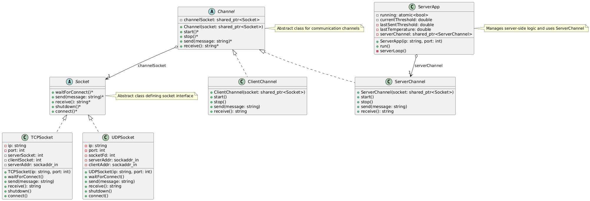

# Socket Programming Driver

## Author: [Mohamed Newir](https://www.linkedin.com/in/mohamed-newir-a8a572182)

## Overview

This project implements a TCP/UDP-based socket programming driver in C++ for client-server communication. It consists of a server and a client application that communicate over a TCP socket to manage temperature thresholds and LED status. The server can set temperature thresholds and request temperature readings from the client, while the client responds with temperature data and updates its LED status based on the server's commands.

## Objective

The objective of this project is to demonstrate a robust client-server communication system using TCP sockets in C++. The system allows:
- The server to set temperature thresholds and send them to the client along with an LED status ("ON" or "OFF").
- The client to receive threshold commands, update its status, and respond to temperature requests with user-inputted temperature values.
- Modular design with abstract interfaces (`Socket` and `Channel`) to support extensibility for different protocols (e.g., TCP and UDP) and communication channels (client and server).


## Project Structure

The project is organized into the following directories and files:

```
/Socket Programming Drivers
├── build
│   ├── client        # Compiled client executable
│   └── server        # Compiled server executable
├── Include
│   ├── channel.hpp        # Abstract base class for communication channels
│   ├── clientChannel.hpp  # Client-specific channel implementation
│   ├── serverChannel.hpp  # Server-specific channel implementation
│   ├── socket.hpp         # Abstract socket interface
│   ├── TCPsocket.hpp      # TCP socket implementation
│   └── UDPsocket.hpp      # UDP socket implementation
├── Source
│   ├── clientChannel.cpp  # ClientChannel class implementation
│   ├── serverChannel.cpp  # ServerChannel class implementation
│   ├── TCPsocket.cpp      # TCPSocket class implementation
│   ├── UDPsocket.cpp      # UDPSocket class implementation
│   ├── client.cpp         # Client application main logic
│   └── server.cpp         # Server application main logic
├── UML
│   └── SocketDriverUML.png  # UML diagrams 
├── CMakeLists.txt          # CMake build configuration
└── README.md               # Project documentation
```

## Prerequisites

- **C++ Compiler**: A C++11 or later compatible compiler (e.g., `g++`).
- **CMake**: Version 3.10 or higher for building the project.
- **Operating System**: Linux or Unix-like system (due to use of POSIX socket APIs).
- **Libraries**: Standard C++ library and POSIX socket libraries (`sys/socket.h`, `arpa/inet.h`, etc.).

## Building the Project

1. Navigate to the project directory:
   ```bash
   cd "Socket Programming Drivers"
   ```

2. Create a build directory and navigate into it:
   ```bash
   mkdir build && cd build
   ```

3. Run CMake to configure the build:
   ```bash
   cmake ..
   ```

4. Build the project:
   ```bash
   make
   ```

This will generate two executables in the `build` directory: `server` , `client` and Static library to be used
later in Server GUI using QT6.

## Usage

### Running the Server
1. Start the server by running the `server` executable, optionally specifying the IP address and port:
   ```bash
   ./build/server [ip] [port]
   ```
   - Default IP: `192.168.7.1`
   - Default port: `8080`
   - Example: `./build/server 127.0.0.1 8080`

2. The server will:
   - Listen for client connections.
   - Prompt for a new temperature threshold or 'q' to quit.
   - Send threshold updates or temperature requests to the connected client.
   - Display received temperature and computed LED status.

### Running the Client
1. Start the client by running the `client` executable, specifying the server's IP address and port:
   ```bash
   ./build/client [ip] [port]
   ```
   - Default IP: `192.168.7.1`
   - Default port: `8080`
   - Example: `./build/client 127.0.0.1 8080`

2. The client will:
   - Connect to the server.
   - Receive and display threshold updates or temperature requests.
   - Prompt for temperature input when requested and send it to the server.
   - Display the current LED status.

### Example Interaction
1. Start the server:
   ```bash
   ./build/server 127.0.0.1 8080
   ```
   Output:
   ```
   Server starting on 127.0.0.1:8080...
   Enter new threshold (e.g., 40) or 'q' to quit:
   ```

2. Start the client in another terminal:
   ```bash
   ./build/client 127.0.0.1 8080
   ```
   Output:
   ```
   Attempting to connect to the server...
   Connected to the server.
   Received new threshold: 30 °C – LED Status: OFF
   ```

3. On the server, enter a new threshold (e.g., `35`):
   ```
   Threshold set to: 35°C
   Sent: set threshold 35 OFF
   ```

4. The client receives the update:
   ```
   Received new threshold: 35 °C – LED Status: OFF
   ```

5. The server sends a temperature request:
   ```
   Sent: get Temp OFF
   ```

6. The client prompts for temperature input:
   ```
   Received command: get Temp
   Enter temperature: 40
   Sending temperature: 40 °C – LED Status: OFF
   ```

7. The server receives the temperature and updates the status:
   ```
   Received temperature: 40°C, LED Status: ON
   ```

8. To stop, enter `q` on the server to gracefully shut down.

## Notes
- The server sends an initial threshold of 30°C with "OFF" status upon client connection.
- The LED status is computed based on whether the temperature exceeds the threshold ("ON" if temperature > threshold, else "OFF").
- The project includes a `UDPSocket` implementation, but it is not used in the current client-server logic (you can change to it in server/client app).
- Ensure the server is running before starting the client to avoid connection errors.

## UML Diagram
A UML class diagram is available in the `UML` directory. It illustrates the class hierarchy, including the abstract `Socket` and `Channel` classes, their implementations, and the relationships with `ServerApp`.




