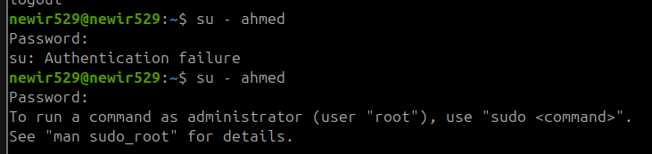

# Linux Administration Project - Part 1
## Author: [Mohamed Newir](https://www.linkedin.com/in/mohamed-newir-a8a572182)

## Overview
This part contains two Bash scripts:

### 1. `userdef.sh`
- This script is used to create a user with a specific password and group name.
- It adds the user to the specified group and updates the user with a specific UID and GID.
- The script includes a cleanup option that removes the user and group if specified.
- It ensures the user running the script has root privileges.
- It validates the number of arguments passed.

#### **Usage:**
```sh
sudo ./userdef.sh <username> <password> <groupname> <clean>
```

#### **Examples:**
```sh
sudo ./userdef.sh mohamed password123 group1 1  # Cleanup user and group
sudo ./userdef.sh mohamed password123 group1 0  # Create user and group, update UID and GID
```

---

### 2. `dir_files_manager.sh`
- This script creates a directory, generates files inside it, and compresses them into a tar file.
- It checks if the directory and tar file exist and deletes them if necessary.
- It verifies whether the user exists and, if so, copies the tar file to the user's home directory and extracts it.

#### **Usage:**
```sh
./dir_files_manager.sh <new_user>
```

---

## Making the Script Globally Reachable

### **1) Running `userdef` from anywhere**

#### **Methods:**
1. **Using an alias**
   ```sh
   alias userdef="sudo /home/newir529/EMBEDDED_LINUX/Linux_Administration/Project/Part1/userdef.sh"
   ```
   
2. **Moving the script to `/usr/local/bin/`**
   ```sh
   sudo mv /home/newir529/EMBEDDED_LINUX/Linux_Administration/Project/Part1/userdef.sh /usr/local/bin/userdef
   sudo chmod +x /usr/local/bin/userdef
   ```
   

### **2) Making the change permanent**
- **Method 1:** Add the alias command to `.bashrc`
  ```sh
  echo 'alias userdef="sudo /home/newir529/EMBEDDED_LINUX/Linux_Administration/Project/Part1/userdef.sh"' >> ~/.bashrc
  ```
  

- **Method 2:** No extra steps are needed once moved to `/usr/local/bin/`

### **3) Applying changes immediately**
- **Method 1:** Source the `.bashrc` file
  ```sh
  source ~/.bashrc
  ```
- **Method 2:** No extra steps required when moved to `/usr/local/bin/`

---

## After Running `dir_files_manager.sh`

### **Steps to Verify and Modify Files**
1. **Switch to the newly created user**
   ```sh
   su - <new_user>
   ```
   
   
2. **Display all files inside the extracted folder recursively with long listing format**
   ```sh
   ls -Ril
   ```
   

3. **Change the owner of the directory recursively to the new user**
   ```sh
   sudo chown -R <new_user> <directory>
   ```
   

4. **Again, display all files inside the extracted folder recursively with long listing format**
   ```sh
   ls -Ril
   ```
   

5. **Search for the word "file" in the extracted directory recursively**
   ```sh
   grep -r "file" .
   ```
   

6. **Remove all files ending with `.c`**
   ```sh
   rm *.c
   ```
   
   
---