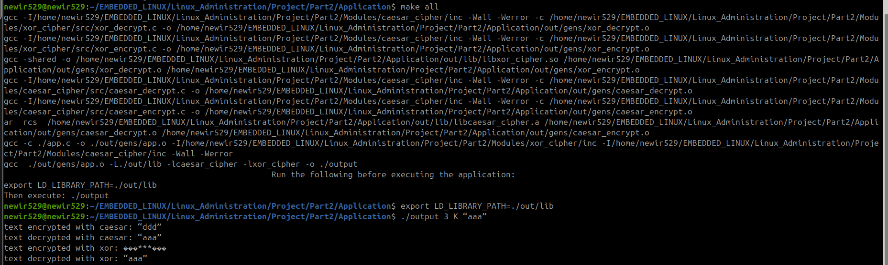

# Linux Administration Project - Part 2
## Author: Mohamed Newir  

## Project Overview  
This project is part of Linux administration course that involves building an application using Makefiles. The project consists of:  
- A main application that utilizes encryption and decryption modules.  
- Two cryptographic modules: **Caesar Cipher** (static library) and **XOR Cipher** (dynamic library).  
- Object files, libraries, and the final application executable are organized under the `Application/out` directory.  

## Project Structure  
```
Project/Part2
├── Application
│   ├── app.c
│   ├── Makefile
│   ├── out
│   │   ├── gens  (Object files)
│   │   │   ├── app.o
│   │   │   ├── caesar_decrypt.o
│   │   │   ├── caesar_encrypt.o
│   │   │   ├── xor_decrypt.o
│   │   │   ├── xor_encrypt.o
│   │   ├── lib  (Libraries)
│   │   │   ├── libcaesar_cipher.a
│   │   │   ├── libxor_cipher.so
│   ├── output (Final executable)
├── Modules
│   ├── caesar_cipher
│   │   ├── caesar_cipher.mk
│   │   ├── inc
│   │   │   ├── caesar_cipher.h
│   │   ├── src
│   │   │   ├── caesar_decrypt.c
│   │   │   ├── caesar_encrypt.c
│   ├── xor_cipher
│   │   ├── xor_cipher.mk
│   │   ├── inc
│   │   │   ├── xor_cipher.h
│   │   ├── src
│   │   │   ├── xor_decrypt.c
│   │   │   ├── xor_encrypt.c
```  

## Build Instructions  
To build the application, navigate to the `Application` directory and run:  
```sh
make
```
This will:  
- Build the **XOR Cipher** dynamic library (`libxor_cipher.so`)  
- Build the **Caesar Cipher** static library (`libcaesar_cipher.a`)  
- Compile the `app.c` source file  
- Link everything together into an executable named `output`  

## Running the Application  
Before running the application, ensure the dynamic library path is set:  
```sh
export LD_LIBRARY_PATH=./out/lib
```
Then execute the program:  
```sh
./output
```  
   


## Cleaning Up  
To remove all generated files (object files, libraries, and executable), use:  
```sh
make clean
```  
To clean only the **XOR Cipher** module:  
```sh
make clean_xor_cipher
```  
To clean only the **Caesar Cipher** module:  
```sh
make clean_caesar_cipher
```  
# Makefile Details

### **Main Makefile (Application/Makefile)**
- Compiles `app.c` into an object file.
- Builds the static and dynamic libraries from the cipher modules.
- Links everything to create the `output` application.

### **XOR Cipher Makefile (Modules/xor_cipher/xor_cipher.mk)**
- Compiles `xor_decrypt.c` and `xor_encrypt.c` into object files.
- Builds `libxor_cipher.so` as a shared library.

### **Caesar Cipher Makefile (Modules/caesar_cipher/caesar_cipher.mk)**
- Compiles `caesar_decrypt.c` and `caesar_encrypt.c` into object files.
- Builds `libcaesar_cipher.a` as a static library.

---

## Author

- **Mohamed Newir**  
  [LinkedIn Profile](https://www.linkedin.com/in/mohamed-newir-a8a572182)