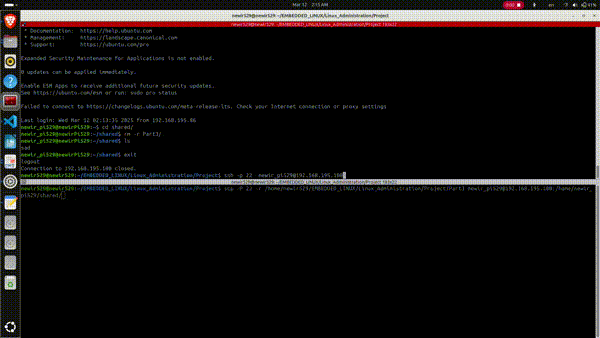

# Linux Administration Project - Part 3
## Author: [Mohamed Newir](https://www.linkedin.com/in/mohamed-newir-a8a572182)

## Project Part 3 Overview
This project is the third part of a **Linux Administration** course project. It involves process management using **fork** and **execv** to execute system monitoring commands (`ps` and `mpstat`). The project is compiled and executed on a host machine before being transferred using `scp` command to a **Raspberry Pi 5** for execution using `ssh` command.

## Project Structure
```
Linux_Administration/Project/Part3/
│-- Build/
│   │-- Output (Executable File)
│-- Source/
│   │-- main.c  (Source Code)
│-- README.md
│-- CMakeLists.txt
```

## Features
- Uses **fork()** and **execv()** system calls to execute:
  - `ps` command (process status)
  - `mpstat` command (CPU usage statistics)
- Transfer `Part3` directory to **Raspberry Pi 5**.
- Compilation and execution of `Part3` on **Raspberry Pi 5** using SSH.


## Compilation and Execution

### Step 1: Transfer to Raspberry Pi 5
Use `scp` to transfer `Part3` directory:
```sh
scp -P 22 -r Project <Raspberry_User_Name>@<RaspberryPi_IP>:/home/<pi_user>/
```
Replace `<RaspberryPi_IP>` with the actual IP address of your Raspberry Pi 5 and `<Raspberry_User_Name>` with the actual raspberry pi user name.

### Step 2 : SSH into Raspberry Pi 5
Log in remotely using SSH:
```sh
ssh -p 22 <Raspberry_User_Name>@<RaspberryPi_IP>
```

### Step 3: Navigate and Compile the Program then Execute it
```sh
cd /home/pi/Project/Part3/Build/
cmake ..
make 
./Output
```
This will execute the `ps` and `mpstat` commands using **fork** and **execv** ant it will show both process status and CPU usage statistics.


---

## Static IP Configuration

- To apply static IP In ubuntu machine using netplan configuration, first you should add the following to your router `yaml` file at `/etc/netplan/[your netplan file].yaml`:

```sh
network:
  version: 2
  wifis:
    [your netplan file name]:
      renderer: NetworkManager
      match:
        name: "wlan0"
      dhcp4: no
      dhcp6: true
      addresses:
        - ***.***.***.100/24 # your device static IP
      routes:
        - to: 0.0.0.0/0
          via: ***.***.***.1 # your router IP
      nameservers:
        addresses:
          - 8.8.8.8 # DNS server for Google
```

- Second run the following commands in the terminal:
```sh
$ sudo netplan generate
$ sudo netplan apply
$ sudo systemctl restart NetworkManager
```

---